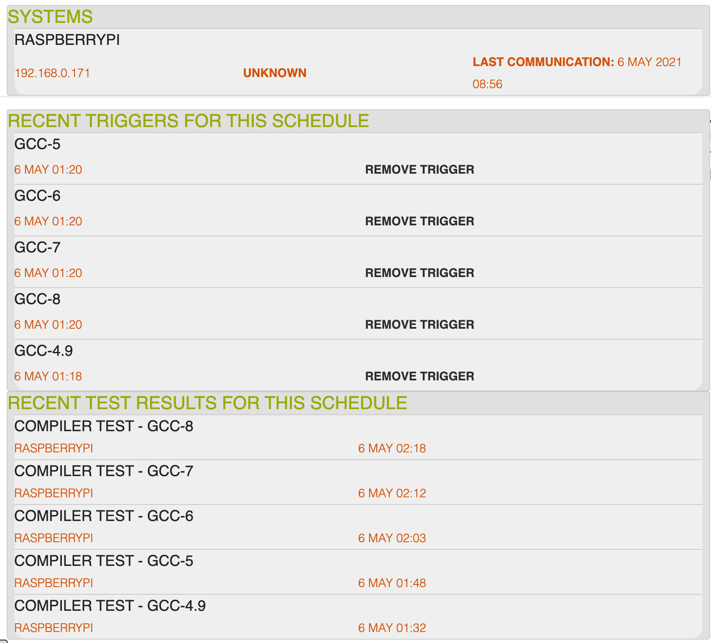
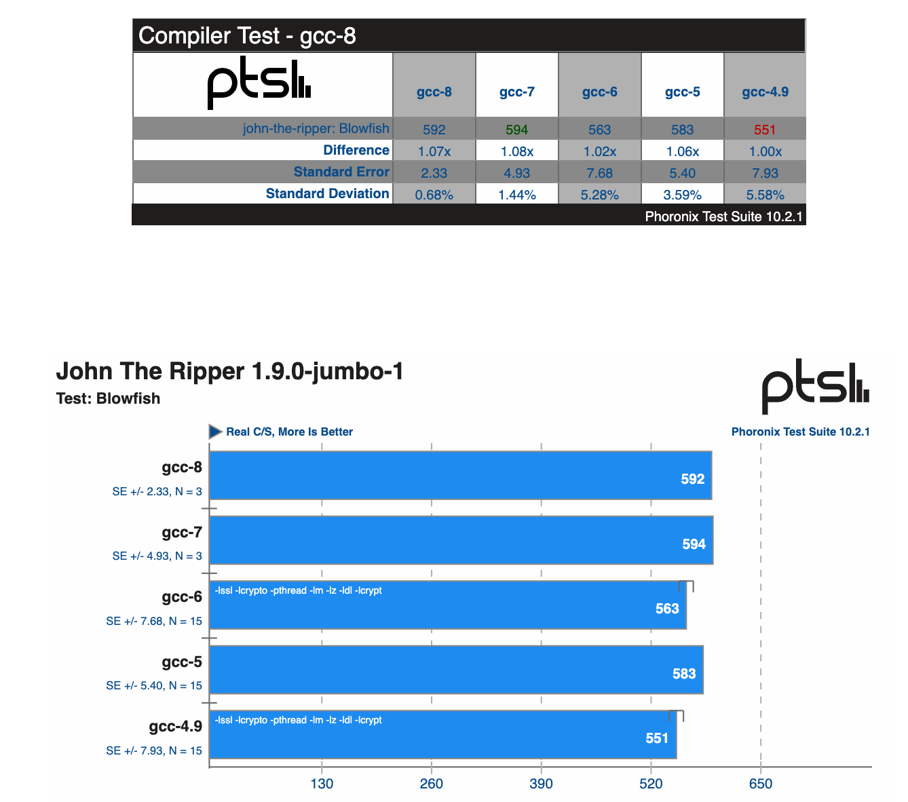

# Using Phoromatic Context Switching

This howto describes to use the Phoromatic lifecycle concept of context to allow automated switching of Configurations under Test with no manual intervention.

## Who needs Context Switching

Context would be used by Phoromatic users that would like to do automated testing of systems while varying features like BIOS, kernel, overclocking features, or compilers.  Phoromatic treats Context as an opaque string with no particular meaning to Phoronix Test Suite. 

## Recommended Background Reading

This howto assumes an understanding of the [Phoromatic Test Lifecycle](./theory-of-operation.md) and uses key terms found in the [Glossary](./glossary.md).

## Pre-requisites

This howto assumes that you have
  - Installed and configured [Phoronix test Suite](./installing.md)
  - Have a [running Phoromatic Server](./phoromatic.md) with a user that is logged in.
  - Have a PTS client that is registered with Phoromatic
  - Have a Phoromatic Test Schedule that is configured for that system.
  - Have a PTS client Debian deriviative that has the update-alternatives

## Scenario

In this scenario our CUT will be differing compilers through gcc versions.  The steps we will take are to 
1. Configure our system to easily switch compilers
2. Create a simple context switching script
3. Trigger a set of benchmarks that exercise different compilers by running the tests under different contexts
4. Compare the results

### Configure Compilers

For this example we will install as many compilers as we can (assuming compatilbility). 

```
$ sudo apt -y install gcc-4.9 g++-4.9 gcc-5 g++-5 gcc-6 g++-6 gcc-7 g++-7 gcc-8 g++-8
```

Then for each of these we will configure them into the alternatives system

```
$ sudo update-alternatives --install /usr/bin/gcc gcc /usr/bin/gcc-4.9 4
$ sudo update-alternatives --install /usr/bin/gcc gcc /usr/bin/gcc-5 5
...
$ sudo update-alternatives --install /usr/bin/g++ g++ /usr/bin/g++-7 7
$ sudo update-alternatives --install /usr/bin/g++ g++ /usr/bin/g++-8 8
```

We can then confirm that the list of compilers are configured as alternatives

```
$ sudo update-alternatives --list gcc
/usr/bin/gcc-4.9
...
/usr/bin/gcc-8
```

Finally, we can confirm that the different compilers are easily switched.

```
$ sudo update-alternatives --set gcc /usr/bin/gcc-6
$ gcc --version
gcc (Raspbian 6.5.0-1+rpi1+b1) 6.5.0 20181026

$ sudo update-alternatives --set gcc /usr/bin/gcc-8
$ gcc --version
gcc (Raspbian 8.3.0-6+rpi1) 8.3.0
```

### Create a test Context Switch

The role of context scripts are to ensure that the system is in a requested context, or report that the system cannot switch into that state.  To achieve this, every context script should take the following steps

1. Determine that the context is valid
2. Determine the current context
3. Switch the context if needed
4. Validate that the context switch has been correctly made

In the case of runtime configuration like the gcc version above this should be relatively easy to inspect and verify.  

For changes that require a reboot you can easily reboot during the context switch.  Phoromatic does not consider a test to be underway until the full pre context switch is completed.  If a PTS Client disconnects from Phoromatic during context switching, the same test and context will be provided to PTS Client upon reconnection.  This allows the context switch to happen on the first execution of the context script, and the context to be confirmed on the second.

For the purposes of this howto, we will use the `update-alternatives --query gcc` to determine context, `update-alternatives --set gcc` to set context, and will use the gcc shortname (eg: `gcc-4.9`, `gcc-5`, etc) as the context.  

Our simple script is shown below. You can test the script by passing in a context as the first parameter

```
#!/bin/sh

# extract our context from the first parameter
_context=${PHOROMATIC_TRIGGER}
_target_binary=/usr/bin/${_context}

echo "Context is ${_context}"
echo "Target binary is ${_target_binary}"

# Validate that the context is valid
# query the alternatives and check for our target binary
if [ ! -x ${_target_binary} ]; then
  echo "Target binary not found, aborting"
  exit 1
fi

update-alternatives --list gcc | grep ${_target_binary} > /dev/null
if [ ! $? ]; then
  echo "Target binary not found in alternatives, aborting"
  exit 2
fi

# Check the current context
update-alternatives --list gcc | grep "link currently points to" | grep ${_target_binary} > /dev/null
if [ $? ]; then
  # If context switch is needed, switch to that context
  sudo update-alternatives --set gcc ${_target_binary}
  # Validate that the new conext is in place
  update-alternatives --list gcc | grep "link currently points to" | grep ${_target_binary} > /dev/null
  if [ ! $? ]; then
    echo "Update context to ${_context} failed, aborting"
    exit 3
  else
    echo "Context updated"
  fi
else
  echo "Context is already ${_context}, continuing"
fi
```


### Trigger a Set of Benchmarks

To determine the URL to use template for for triggering a test execution with context, visit the Test Schedule page within Phoromatic.  This will provides you with the URL needed for triggering events.  In the case of this howto, the URL that can be used is `http://192.168.0.171:8677/event.php?type=trigger&user=mtippett&public_key=RRLU6CESBWP4&trigger=trigger`


Within that URL, the opaque context string should be clear.  As prepared above, we will use the compiler string (eg: `gcc-7`) as the context.

To queue up our tests, we can simply execute the URL as follows

```
$ curl 'http://192.168.0.171:8677/event.php?type=trigger&user=mtippett&public_key=RRLU6CESBWP4&trigger=gcc-7'
Trigger gcc-7 added!%
```

Within the phoromatic environment you can see that the test will be queued.


On the PTS Client, you will also see the following the job being triggered

```
[05:07:24] Idling, waiting for task assignment...
Updated OpenBenchmarking.org Repository Index
pts: 470 Distinct Tests, 1836 Test Versions, 58 Suites
    Evaluating External Test Dependencies ........
    To Install:    pts/john-the-ripper-1.7.2
```

From here, we can use secondary automation to queue up the series of tests, and then wait for the tests to complete.

```
$ curl 'http://192.168.0.171:8677/event.php?type=trigger&user=mtippett&public_key=RRLU6CESBWP4&trigger=gcc-4.9'
Trigger gcc-4.9 added!%
$ curl 'http://192.168.0.171:8677/event.php?type=trigger&user=mtippett&public_key=RRLU6CESBWP4&trigger=gcc-5'
Trigger gcc-5 added!%
$ curl 'http://192.168.0.171:8677/event.php?type=trigger&user=mtippett&public_key=RRLU6CESBWP4&trigger=gcc-6'
Trigger gcc-6 added!%
$ curl 'http://192.168.0.171:8677/event.php?type=trigger&user=mtippett&public_key=RRLU6CESBWP4&trigger=gcc-7'
Trigger gcc-7 added!%
$ curl 'http://192.168.0.171:8677/event.php?type=trigger&user=mtippett&public_key=RRLU6CESBWP4&trigger=gcc-8'
Trigger gcc-8 added!%
```

In a non trivial environment, these URLS would be triggered by build completion, system availability, code commits or other triggers.  

Within the Phoromatic UI, you will see a collection of triggers and the the PTS Clients will work through the collection of triggers as shown below.



### Compare our Results

Once all the tests have been completed, we can then compare against the different runs to identify regressions or other issues.



In this particular case we can see that newer versions of gcc are about 7 to 8% faster than older versions.


### Easily extending the approach

Now that we have a simple script in place we extend that to test other parts of the systems such as considering new kernels, or different kernel parameters.

## Alternatives

For continuous integration systems we commonly use git commit hash (eg: a1fb3a322) as a context that allows for easy integration of a git commit hook notification to be passed to a context 
